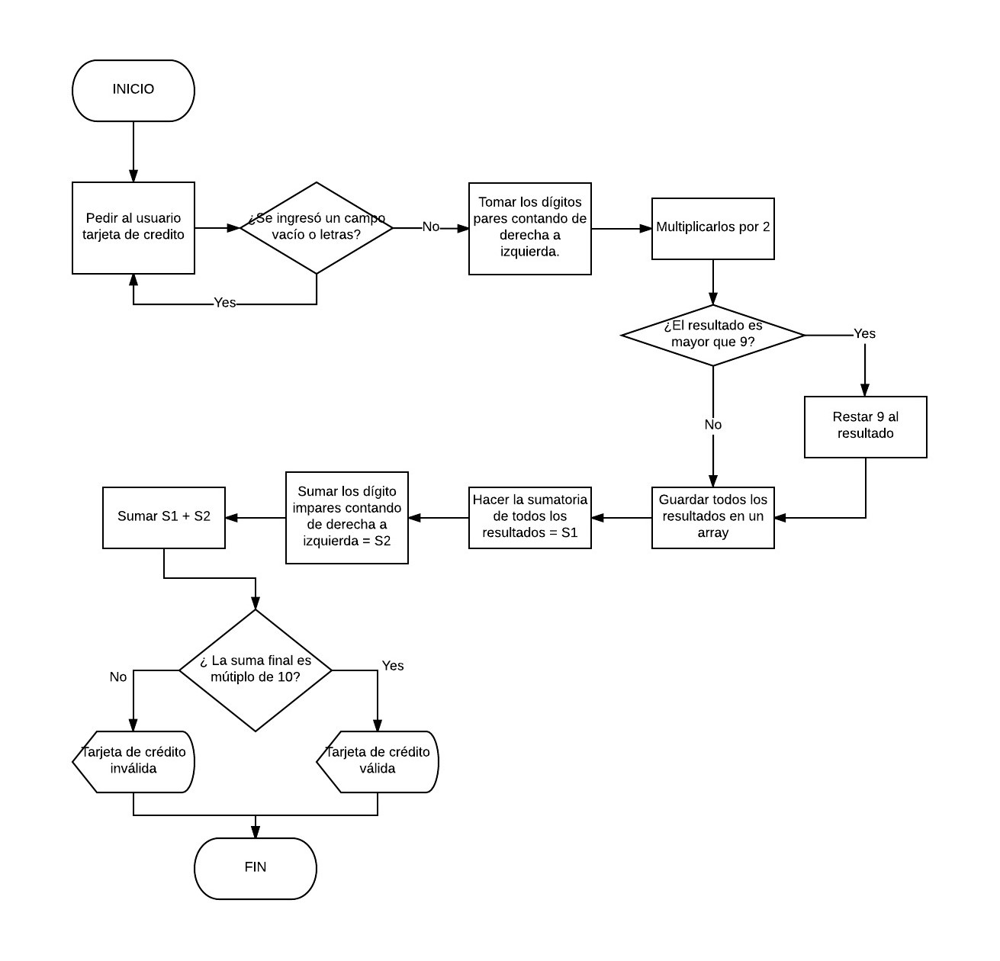

# Tarjeta de crédito válida

Crea una web que pida, por medio de un `prompt()`, el número de una tarjeta de
crédito y confirme su validez según el [algoritmo de Luhn](https://es.wikipedia.org/wiki/Algoritmo_de_Luhn).  
Lee este blog que explica [cómo funciona el algoritmo de Luhn](http://www.quobit.mx/asi-funciona-el-algoritmo-de-luhn-para-generar-numeros-de-tarjetas-de-credito.html).

## Consideraciones específicas

1. El código debe estar compuesto por 1 función: `isValidCard`.
2. El usuario no debe poder ingresar un campo vacío.

## Pseudocódigo

FUNCION `isValidCard` de `creditCard`{

VAR `centinel` = false  
VAR `evenDigits` = []  
VAR `sum` = 0  

BUCLE for (Iniciar contador i en `creditCard.length - 2`; validar si es `>= 0`; disminuir en 2){  
Si (`creditCard[i] * 2 > 9)` &rarr;
  `creditCard[i] * 2 - 9` ingresa como elemento de `evenDigits`  
Sino &rarr; (`creditCard[i] * 2`) ingresa como elemento de `evenDigits`}  

BUCLE for (Iniciar i en `creditCard.length -1`; validar si es `>= 0`; disminuir i en 2){  
`sum = sum + evenDigits[i]`}

BUCLE for (Iniciar i en 0; validar que sea menor que `evenDigits.length`; aumentar i en 1){  
`sum = sum + [Elemento en posición i]` 
}

Si (`sum % 10 == 0`) &rarr; Alerta 'Tarjeta válida' &rarr; `centinel = true`  
Sino &rarr; Alerta 'Tarjeta inválida' &rarr; `centinel = false`

**RETORNA `centinel`**

## Diagrama de flujo

