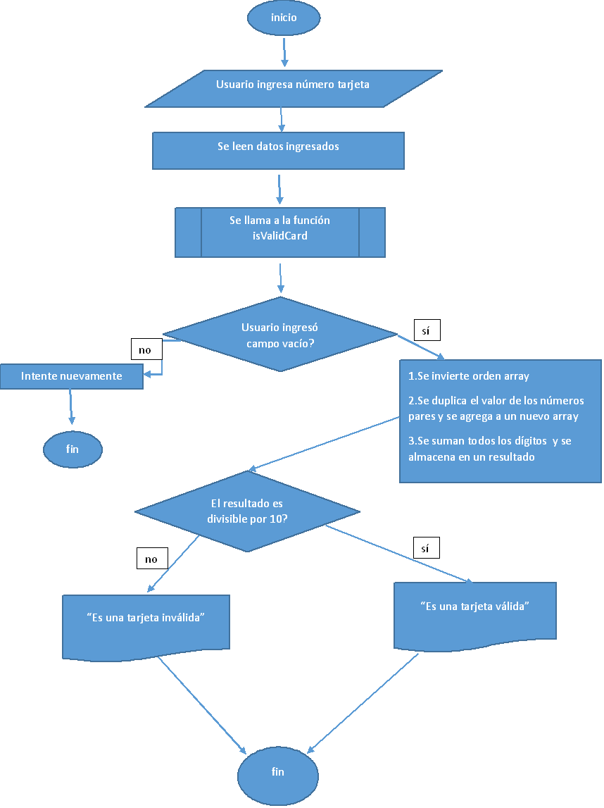

# Tarjeta de Crédito

## Segundo ejercicio Producto Final

Nos piden crear una web que pida, por medio de un `prompt()`, el número de una tarjeta de crédito y confirme su validez según el [algoritmo de Luhn]
 que el usuario ingrese el número de su tarjeta y validar:

## Consideraciones

1.El usuario no debe poder ingresar un campo vacío.
2.El código debe estar compuesto por 1 función: isValidCard

### Diagrama de flujo

### Pseudocódigo

~~~~

usuario ingresa datos
lee datos
procedimiento isValidCar
   Si datos es vacío entonces
    escribir "Try again";
   Si no entonces
     para (i=numberCard.length-1; i>=0;i--)
       invertir digitos
     fin para
     para ( j=0;j<newArray.length;j++)
duplicar valores pares y almacenar en un array
     fin para
     para ( k=0;k<n.length;k++)
sumar los dígitos obtenidos
Si suma de dígitos es divisible por 10
escribir "Es una tarjeta válida"
Si no entonces
escribir "Es una tarjeta inválida"
fin para

~~~~