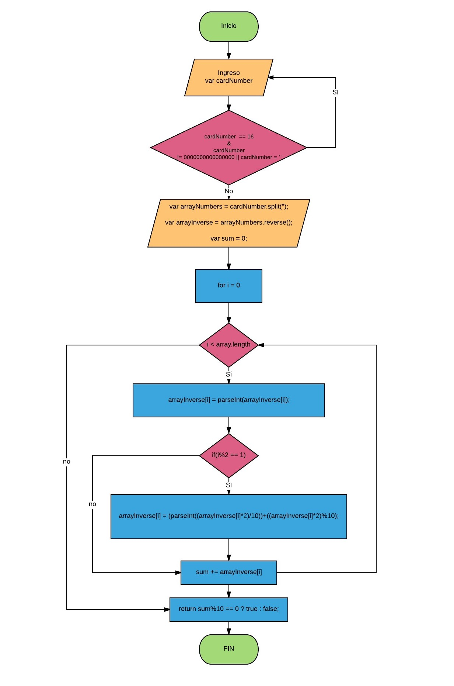

# VALID CREDIT CARD
#### Contenido:
1. Diagrama de flujo validCard.
2. Pseudocódigo validCard.
3. Explicación del código.

--------------------------

### 1. DIAGRAMA DE FLUJO

[diagramaflujo](https://ibb.co/crgeFb)

### 2. PSEUDOCÓDIGO

    inicioProceso
      escribir cardNumber

      función isValidCard <--- (cardNumber)

        Crear variables
        var arrayNumbers, arrayInverse, sum

        Almaceno en la variable cada ejecución
        arrayNumbers <-- cardNumber.split('')
        arrayInverse <-- arrayNumbers.reverse()
        sum <-- 0

        Bucle : Para i == 0  Hasta i < longitudArrayNumbers Con Paso i++ Hacer
        arrayInverse[i] <-- parseInt(arrayInverse[i])

          Si (i % 2 == 1) Entonces
            arrayInverse[i] <--suma de digitos(multiplicar*2 (indices impares))

          Fin Si
         sum <-- suma de digitos d ela tarjeta

        Fin Bucle

        retornar sum % 10 == 0 ? true : false
        Fin función

    Fin Proceso

--------------------------------------------

### 3. EXPLICACIÓN DEL CÓDIGO

Se nos pide hacer la validación de un número de tarjeta de crédito utilizando el algoritmo de Luhn.

**Ingreso de datos**

Aquí solicitamos el número de tarjeta, mediante un `prompt`, y lo guardamos en la variable cardNumber.

`var cardNumber = prompt ("Ingrese su número de tarjeta: ");`

Ejemplo: cardNumber = '4975226157921705'

>NOTA: Al ingresar un dato mediante prompt, este siempre es de tipo string, así que el número de tarjeta ingresado, será de tipo string.

**Creación de la función isValidCard**

`function isValidCard(cardNumber){}`

**Proceso para validar el número**
  
* Convertimos el string en un array con separacion de (''), con el método split: 

  `var arrayNumbers = cardNumber.split('');`

  Obteniendo: ['4', '9', '7', '5', '2', '2', '6', '1', '5', '7', '9', '2', '1', '7', '0', '5' ]

* Para seguir con el algoritmo de Luhn, invertimos el array, con `reverse()`:

  `var arrayInverse = arrayNumbers.reverse();`

  Obteniendo: ['5', '0', '7', '1', '2', '9', '7', '5', '1', '6', '2', '2', '5', '7', '9', '4' ]

* Creamos el acumulador suma para almacenar más adelante, la suma de dígitos.

  `var sum = 0;`

* Ahora, vamos a convertir los elementos del array tipo string a tipo number.

       for(var i = 0; i < arrayInverse.length; i++{
        arrayInverse[i] = parseInt(arrayInverse[i]);
       }

  Se obtendrá: [5, 0, 7, 1, 2, 9, 7, 5, 1, 6, 2, 2, 5, 7, 9, 4 ]

* Debemos multiplicar x2 a las posiciones impares de nuestro array, teniendo encuenta que inicializamos con i = 0, para ello hacemos un if.

* Despues debemos sumar los dígitos de los resultados, es decir, si en mi posición i = 5, obtengo un dígito de dos cifras, por ejemplo, 18, debo sumar 1 + 8:

* Aplicando parseInt obtenemos la parte entera: 

  `18 / 10 = 1.8` &rarr;  `parseInt(18 / 10) = 1`

* Aplicando MOD obtenemos el segundo dígito 

  `18 % 10 = 8`

* En código será asi:

      if(i % 2 == 1){
      arrayInverse[i] = (parseInt((arrayInverse[i] * 2 )/ 10 )) + ((arrayInverse[i] * 2 ) % 10 );
      }

>NOTA: Lo que ejecuta el IF será la suma de los digitos, almacenado en el mismo array.

* Debemos obtener la suma de elementos, para ellos utilizaremos nuestro acumulador sum, creado anteriormente.

      sum += arrayInverse[i];

    Dando como resultado, según nuestro ejemplo, 70.

* Para comprobar si este número de tarjeta es válido, y no una serie de número al azar, nuestra suma MOD 10 debe resultar 0.

      sum % 10 == 0
										
  Para este ejemplo `70 % 10 = 0`, es decir, nuestra tarjeta es válida.

* Por último mostrar un document.write que indique el resultado de la validación.

      return sum % 10 == 0 ? document.write('Su número de tarjeta es válido')  : document.write('Su número de tarjeta NO es válido') ;

* Finalmente, no olvidar invocar la función.

      isValidCard (cardNumber);