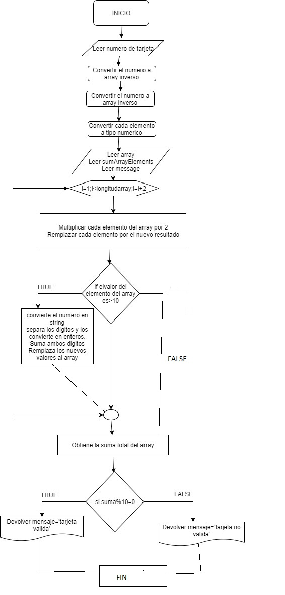

* # Pseudocodigo isValidCard
* function isValidCard(cardNumber)
    * Repetir
       *  mensajecardNumber = 'Ingrese el número de la tarjeta de crédito a validar';
    *  hasta ((cardNumber.length) <= 0);
    *  reverseCardNumber = cardNumber.split('').reverse().map(Number);
    * Leer sumArrayElements = ''
    * Leer message = '';
    * Para ( i = 1; i < reverseCardNumber.length; i = i + 2)
        * reverseCardNumber[i] = reverseCardNumber[i] * 2;
        *  if (reverseCardNumber[i] >= 10) entonces
            * separatedDigits = reverseCardNumber[i].toString().split('').map(Number);
            * reverseCardNumber[i] = (separatedDigits[0] + * separatedDigits[1]);
        * fin si
        Leer sumArrayElements += reverseCardNumber[i];
    * Fin para
    * si (sumArrayElements % 10 === 0) entonces
      * escribir message = 'valido'
    * si no
      * escribir message = 'invalido';
    * mostrar message;
* Fin funcion
# Diagrama de Flujo

